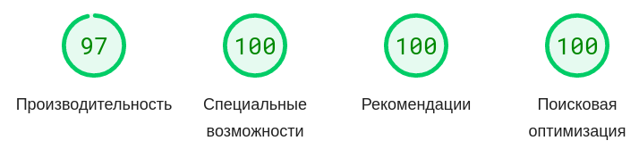
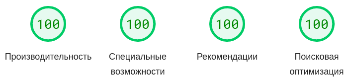

# МБУ School 40 9b <3

# About the project:
* This project made at the beginning of 9th grade, so that everyone who studied in my class could see their own and general photos, they can remember something etc...

## Responsive-adaptive support:
* i. Desktop `(1450px+)`
* ii. Desktop-min `(1449px - 992px)`
* iii. Tablet `(991px - 756px)`
* iiii. Phone-big `(755px - 576px)`
* iiiii. Phone `(575px - 414px)`
* iiiiii. Phone-min `(413px - 245px)`
* iiiiiii. Smart Watch `(244px-)`

## Technology steck(vanilla-all):
1.  **HTML**
2.  **CSS**
3.  **JavaScript**

## Implemented:
* [x] Scroll Menu 📜
* [x] Switch Theme (`🌝 light` | `🌚 dark`)
* [x] Popup
* [x] Slider🎚 (library: Swiper)
* [x] 404 Page 😎
* [x] Performance 🏎
* [x] Accessibility - AAA (`😑👍 A11y`)
* [x] Search Engine Optimization (`🔍 SEO`)

---

### Project link on ☛ [**Github Pages**](https://quickyoung.github.io/School40_9B/)

---

### Statistic:
* ##### Statistics on the phone

* ##### Statistics on the computer

